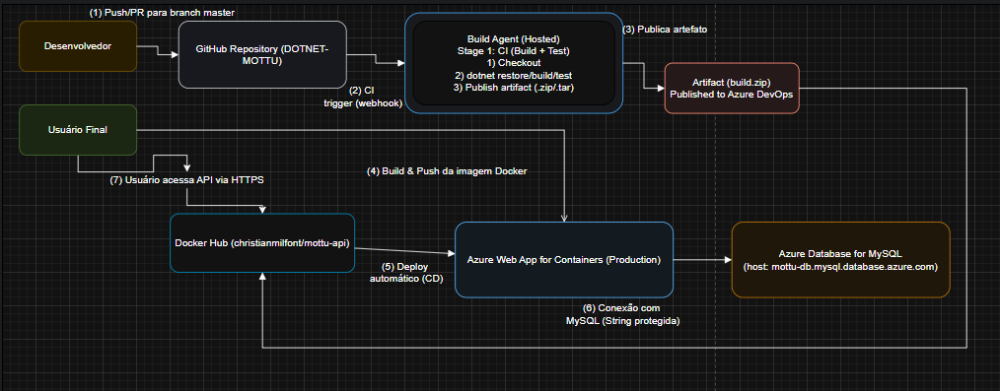

# Descrição breve da solução

---

### O que a aplicação faz
API .NET (ASP.NET Core Web API) que expõe endpoints para gerenciar recursos do Mottu (ex.: Pátio, Cliente e Moto). A API usa MySQL Express como banco de dados.

### Stack tecnológica

Backend: .NET 8/7 (ajuste conforme seu projeto) — ASP.NET Core Web API

Banco de dados: Azure Database for MySQL (PaaS).

Container registry: Azure Container Registry (ACR)

CI/CD: Azure DevOps Pipelines (YAML) conectados ao repositório GitHub

Infra / deploy: Azure Web App for Containers ou Azure Container Instances (ACI) (usaremos Web App for Containers no exemplo)

Autenticação/Secrets: Azure DevOps Library (secure variables) ou Service Connections


---

# Arquitetura + Fluxo CI/CD (diagrama)

Diagrama feito para demonstrar o Fluxo CI/CD 
- Para analisar a Arquitetura



---

## Requisitos - Sprint 4
```bash

| Nome do componente                | Tipo                    | Descrição funcional                                                                 | Tecnologia / Ferramenta                         |
|-----------------------------------|-------------------------:|-------------------------------------------------------------------------------------|-------------------------------------------------|
| Repositório de código (SCM)       | Git (hosted)            | Código-fonte da aplicação e pipelines (YAML)                                       | GitHub (https://github.com/christianmilfont/...) |
| Pipeline / Orquestrador CI        | CI/CD                   | Compila, executa testes unitários, publica artefato e gera imagem Docker           | Azure DevOps Pipelines (YAML multi-stage)      |
| Registry de Imagens               | Container Registry      | Armazena imagem Docker utilizada no deploy                                         | Docker Hub (ou GitHub Container Registry / ACR)|
| Build Agent                       | Runner                  | Executa jobs de build/test/push                                                     | Azure DevOps Hosted Agents                      |
| Artifact Storage                  | Artifact                | Publicação do build para acionar release                                           | Azure DevOps Artifacts                          |
| Ambiente de Execução (Prod)       | PaaS / Web App          | Hospeda a API dentro de container Docker                                            | Azure Web App for Containers                    |
| Banco de Dados (Produção)         | PaaS - RDBMS            | Banco MySQL gerenciado (produção)                                                  | Azure Database for MySQL (Single Server/Pas)    |
| Secret Management                  | Variáveis protegidas    | Armazenamento de strings de conexão, usuários, senhas e chaves de serviço          | Azure DevOps Library (Variable groups - secret) |
| Infra as Code (opcional)          | IaC                     | Provisionamento automatizado dos recursos (opcional)                               | ARM Templates / Bicep / Terraform               |
| Monitoramento / Logging (recomend)| Observability           | Logs e métricas (opcional)                                                          | Azure Monitor / Application Insights (opcional) |

```

---


## Banco de Dados em Nuvem (Azure Database for MySQL) — pontos principais

Escolha do nosso Grupo: Azure Database for MySQL

```bash
Resource Group: rg-sprint4-mottu

Nome do servidor: mottu-mysql-prod → DNS: mottu-mysql-prod.mysql.database.azure.com

Tier: Basic / Burstable / General Purpose (avaliar custo)

Versão MySQL: 8.0

Storage: 5–20 GB (depende do seu volume)

Conexões/Firewall: liberar IP do Web App (ou permitir acesso via VNet)

SSL: habilitar e ajustar connection string no app (use SslMode=Preferred ou Required conforme a política)

Usuário admin: admin@<server> (armazenar no Azure DevOps Library secret)

String de conexão (exemplo):

Server=mottu-mysql-prod.mysql.database.azure.com;Database=mottudb;User Id=admin@mottu-mysql-prod;Password=<SENHA>;SslMode=Required;

```

Observação: não usar H2/MongoDB Atlas conforme restrição do enunciado.

---

Regras da Pipeline (obrigatórias no enunciado) — como atendemos:
I. Pipeline conectado ao GitHub: configure Webhook/Service connection no pipeline.
II. CI disparando a cada alteração na master: trigger: branches: include: - master.
III. CD disparar após novo artefato gerado: multi-stage com stage Deploy que depende do Build/Publish.
IV. Variáveis protegidas: usar Variable Groups e marcar secrets.
V. Gerar e publicar artefato: publish: $(Build.ArtifactStagingDirectory)/app.zip.
VI. Execução de testes: dotnet test no stage de CI.
VII. Deploy com imagem Docker no Azure Web App for Containers (o YAML irá buildar a imagem, push ao Docker Hub e atualizar o Web App com a imagem).